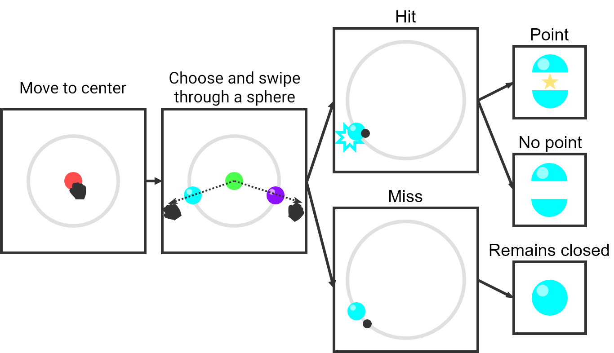

# PSYC1036 Study

Hello,

Thank you for confirming your booking slot for the experimental part of your second research practical for PSYC1036.

To carry out the study, you will need to visit 1.45 (Computer Cluster, School of Psychology). Please arrive 5 minutes before your allotted time.

The experiment will allow you to understand the design of the study you will be analysing data from for Practical Report 2, but note that taking part is OPTIONAL and will not compromise your learning i.e. we will provide detailed instructions on the study for you to write up even if you don’t take part.

Presented below is information on what you should expect for the study:

## Decision making task

This task investigates human decision making in the context of motor control.

The task will be performed in using Virtual Reality headset. Once set up, you will first move your hand towards a red circle. When it turns green, you must then select one of the two spheres presented to your left and right. You should swipe through the sphere as if you were trying to slice it open. You will repeat this decision several times.
 

### If you HIT the sphere

It can be difficult to hit the sphere sometimes as you won't be able to see your hands throughout the task. If you do hit the sphere, it will open up, and sometimes reveal a star (worth 1 point). Other times, it will be empty. 

### If you MISS the sphere

If you miss the sphere, it will not open up and you won't recieve any points.

### Your goal

Every time you are presented with the choice between the two spheres, you should select the sphere which you believe is most likely to give you a star. 

We will score each person on a critera based on a combination of the total number of stars (points) you collect as well as your movement accuracy. The top scorers will recieve cash prizes.

You will be asked to complete a short survey once completed.

## Information

This study has received ethical approval from the School of Psychology Ethics Board (271016/IM/216). By taking part you agree that data collected during the task will be used for research purposes.

Contact Jack for any further information: ed11jb@leeds.ac.uk
